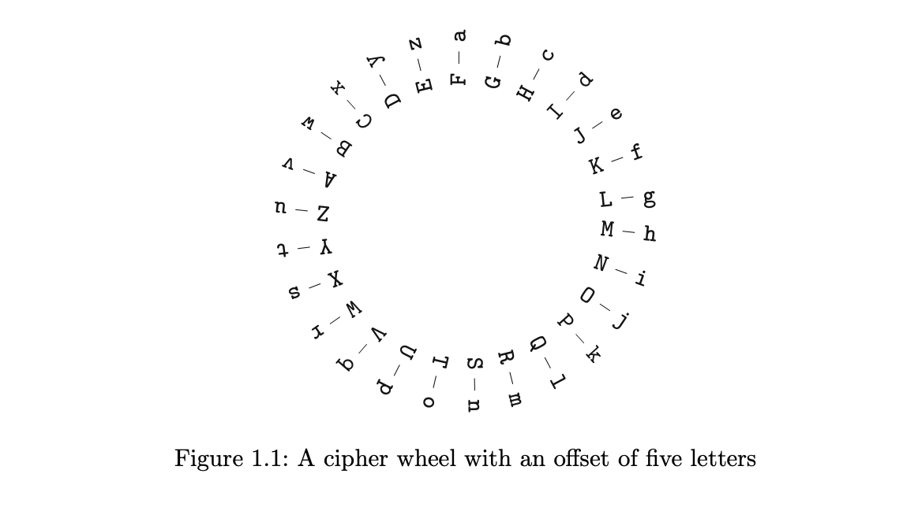

# Chapter 1 - An Introduction to Cryptography

## 1.1 Simple Substitution Ciphers

Caesar is a simple substitution cipher which shifts every letter by a specific number (for example 5)


jsjrdkfqqnslgfhpgwjfpymwtzlmnrrnsjsyqzhnzx

enemyfallingbackbreakthroughimminentlucius



simple substitution may differ from caesar (shift cipher) to random mapping

$$
\{a,b,c,d,e,...,x,y,z\} \rightarrow \{A,B,C,D,E,...,X,Y,Z\}
$$

we can create encryption and decryption table to make encryption and decryption processes more convinient


### 1.1.1 Cryptanalysis of Simple Substitution Ciphers

how many simple substitution ciphers?

$$
26 \times 25 \times 24 \times ... \times 3 \times 2 \times 1 = 26! = 403291461126605635584000000
$$

sthere are a lot of possible keys for Eve to break Alice and Bob encrypted message. it takes $10^{10}$ years if she can try 1 million keys per second. so this looks impossible. right?


**Your opponent always uses her best strategy to defeat you, not the strategy that you want her to use. Thus the security of an encryption system depends on the best known method to break it. As new and improved methods are developed, the level of security can only get worse, never better.**


letters in english are not random. for example letter `e` is much more frequent and `e` is mostly followed by `t,a,o,n` and `q` is usually followed by `u` and it is unlinkely to see letters `fc` beside eachother.


the goal of decryption a simple substitution cipher is not decrypting the cipher text but it is introducing a new idea named **statistical analysis** in terms of cryptanalysis.

an example

```
LOJUM YLJME PDYVJ QXTDV SVJNL DMTJZ WMJGG YSNDL UYLEO SKDVC
GEPJS MDIPD NEJSK DNJTJ LSKDL OSVDV DNGYN VSGLL OSCIO LGOYG
ESNEP CGYSN GUJMJ DGYNK DPPYX PJDGG SVDNT WMSWS GYLYS NGSKJ
CEPYQ GSGLD MLPYN IUSCP QOYGM JGCPL GDWWJ DMLSL OJCNY NYLYD
LJQLO DLCNL YPLOJ TPJDM NJQLO JWMSE JGGJG XTUOY EOOJO DQDMM
YBJQD LLOJV LOJTV YIOLU JPPES NGYQJ MOYVD GDNJE MSVDN EJM
```

Let's first sort letters based on their frequencies


here is English most frequent bigrams


Let's replace high frequent letters with the real ones(e)


Continueing replacing letters based on English words


And here is the final decrypted text:

The writer claimed by a momentary expression, a twitch of a mus- cle or a glance of an eye, to fathom a man’s inmost thoughts. His conclusions were as infallible as so many propositions of Euclid. So startling would his results appear to the uninitiated that until they learned the processes by which he had arrived at them they might well consider him as a necromancer.


## 1.2 Divisibility and Greatest Common Divisors

This section is about studying the natural numbers (1,2,3,4,...) or generally integer numbers (... ,-3,-2,-1,0,1,2,3,...) which is called **number theory**. operations defined over the set of integers (Z) should results in the same set which in other words should be integers.
for example we can add, multiply and substract integers which results in integers. but we can not divide integers that assures the output is also an integer. so we define something named Divisibility.

**Definition.** Let a and b be integers with $b  ̸= 0$. We say that $b$ divides $a$, or that $a$ is divisible by $b$, if there is an integer $c$ such that

<center>
$a = bc$
</center>

We write $b|a$ to indicate that $b$ divides $a$. If $b$ does not divide $a$, then we write $b \nmid a$.

Example:

$847 | 485331$ because $485331 = 847 \times 573$

$259943 \nmid 355$ because $259943 = 355 \times 732 + 83$

every integer is divisible by 1. integers that are divisible by 2 are **even**  and those are not divisible by 2 are **odd**.

**Proposition 1.4** Let $a$, $b$, $c ∈ Z$ be integers.

(a) If $a|b$ and $b|c$, then $a|c$.

(b) If $a|b$ and $b|a$, then $a=±b$.

(c) If $a|b$ and $a|c$, then $a|(b+c)$ and $a|(b−c)$.


**Definition.** A common divisor of two integers $a$ and $b$ is a positive integer $d$ that divides both of them. The **greatest common divisor** of $a$ and $b$ is, as its name suggests, the largest positive integer $d$ such that $d | a$ and $d | b$. The greatest common divisor of $a$ and $b$ is denoted **gcd(a,b)**. If there is no possibility of confusion, it is also sometimes denoted by $(a, b)$. (If $a$ and $b$ are both $0$, then $gcd(a, b)$ is not defined.)

**Example 1.5.** The greatest common divisor of 12 and 18 is 6, since $6 | 12$ and $6 | 18$ and there is no larger number with this property. Similarly,

<center>
$gcd(748, 2024) = 44$
</center>

One way to check that this is correct is to make lists of all of the positive divisors of 748 and of 2024.

Divisors of 748 = $\{1, 2, 4, 11, 17, 22, 34, 44, 68, 187, 374, 748\}$

Divisors of 2024 = $\{1, 2, 4, 8, 11, 22, 23, 44, 46, 88, 92, 184, 253,506, 1012, 2024\}$

we see that 44 is greatest common divisor. but this is not an efficient way for large numbers.


**Definition.** (Division With Remainder) Let $a$ and $b$ be positive integers. Then we say that $a$ divided by $b$ has _quotient_ $q$ and _remainder_ $r$ if

<center>
$a = b · q + r \quad with \quad 0 ≤ r < b$
</center>


Suppose now that we want to find the greatest common divisor of $a$ and $b$. We first divide $a$ by $b$ to get

<center>
$a = b · q + r \quad with \quad 0 ≤ r < b.$
</center>

If $d$ is any common divisor of $a$ and $b$, then it is clear from Eq. (1.1) that $d$ is also a divisor of $r$. (See Proposition 1.4(c).) Similarly, if $e$ is a common divisor of $b$ and $r$, then above equation shows that $e$ is a divisor of $a$. In other words, the common divisors of $a$ and $b$ are the same as the common divisors of $b$ and $r$; hence

<center>
$gcd(a, b) = gcd(b, r)$
</center>

We repeat the process, dividing b by r to get another quotient and remainder, say

<center>
$b=r·q + r \quad with \quad 0≤r'<r$
</center>

Then the same reasoning shows that

<center>
$gcd(b, r) = gcd(r, r )$
</center>

Continuing this process, the remainders become smaller and smaller, until eventually we get a remainder of $0$, at which point the final value $gcd(s, 0) = s$ is equal to the gcd of $a$ and $b$. This algorithm ic called **Euclidean algorithm**


Here is an example from book


**Theorem 1.7** (The Euclidean Algorithm). Let $a$ and $b$ be positive integers with $a ≥ b$. The following algorithm computes $gcd(a, b)$ in a finite number of steps.


(1) Let $r_0 = a$ and $r_1 = b.$

(2) Set $i=1$

(3) Divide $ri−1$ by $ri$ to get a quotient $q_i$ and remainder $r_{i+1}$,
<center>
$ri−1 = r_i·q_i + r_{i+1} \quad with \quad 0 ≤ r_{i+1} <ri$
</center>

(4) If the remainder $r_{i+1} = 0$, then $r_i = gcd(a, b)$ and the algorithm terminates.

(5) Otherwise, $r_{i+1} > 0$, so set $i=i+1$ and go to Step 3.

_The division step (Step 3) is executed at most_

<center>
$2 log_2 b + 2 \quad$ times
</center>

Here is the overall look for step by step of Euclidean algorithm


Let's see a claim


Hence if $2k ≥ b$, then $r_{2k+1} < 1$, which forces r_{2k+1} to equal $0$ and the algorithm to terminate. In terms of Fig.1.2, the value of r_{t+1} is $0$, so we have $t + 1 ≤ 2k + 1$, and thus $t ≤ 2k$. Further, there are exactly $t$ divisions performed in Fig. 1.2, so the Euclidean algorithm terminates in at most $2k$ iterations. Choose the smallest such $k$, so $2k ≥ b > 2k−1$. Then

<center>
$\# \space of \space iterations ≤ 2k = 2(k − 1) + 2 < 2 log2(b) + 2,$
</center>

which completes the proof of Theorem 1.7.


Let's see an example for step by step demonstration for Euclidean algorithm.


**Theorem 1.11** (Extended Euclidean Algorithm). Let $a$ and $b$ be positive integers. Then the equation

<center>
$au + bv = gcd(a, b)$
</center>

**Proof.** Look back at Fig.1.2, which illustrates the Euclidean algorithm step by step. We can solve the first line for $r_2 = a − bq_1$ and substitute it into the second line to get

<center>
$b=(a−bq_1)q_2 + r_3, \quad so \quad r_3 =−aq_2 +b·(1+q_1q_2)$.
</center>

Next substitute the expressions for $r_2$ and $r_3$ into the third line to get

<center>
$a−bq_1 = (−a·q_2 +b·(1+q_1q_2))q_3 +r4$
</center>

After rearranging the terms, this gives

<center>
$r_4 = a(1+q_2q_3)−b(q_1 + q_3 + q_1q_2q_3)$

$r_4 = gcd(a,b)$

$gcd(a,b) = au + bv$
</center>


**Definition.** Let $a$ and $b$ be integers. We say that $a$ and $b$ are relatively prime if $gcd(a, b) = 1$.


More generally, any equation

<center>
$Au + Bv = gcd(A, B)$
</center>

can be reduced to the case of relatively prime numbers by dividing both sides by $gcd(A, B)$. Thus

<center>
$A u+ B v=1, gcd(A, B) gcd(A, B)$
</center>

where $a = \frac{A}{gcd(A,B)}$ and $b = \frac{B}{gcd(A, B)}$ are relatively prime and satisfy $au+bv = 1$.

For example, we found earlier that 2024 and 748 have greatest common divisor 44 and satisfy

<center>
$−7 · 2024 + 19 · 748 = 44.$
</center>

Dividing both sides by 44, we obtain

<center>
$−7 · 46 + 19 · 17 = 1.$
</center>

Thus $2024/44 = 46$ and $748/44 = 17$ are relatively prime, and $u = −7$ and $v = 19$ are the coefficients of a linear combination of $46$ and $17$ that equals $1$.


Let's introduce a new idea of solving and finding u,v. We first illustrate with the example $a = 73$ and $b = 25$. The Euclidean algorithm gives

<center>
$73 = 25 · 2 + 23$
</center>


## 1.3 Modular Arithmetic

**Definition.** Let $m ≥ 1$ be an integer. We say that the integers a and b are congruent modulo m if their difference $a − b$ is divisible by $m$. We write

<center>
$a \equiv b \quad \mod m$
</center>

To indicate that $a$ and $b$ are congruent modulo $m$. The number $m$ is called the **modulus**.


**Proposition 1.13.** Let $m ≥ 1$ be an integer.

(a) If $a1 \equiv a2 \pmod{m} \quad and \quad b1 \equiv b2 \pmod{m}, then$

<center>
$a1 ±b1 \equiv a2 ± b2 \pmod{m} \quad and \quad a1·b1 \equiv a2·b2 \pmod{m}.$
</center>


(b) Let $a$ be an integer. Then
<center>
$a·b \equiv 1 \pmod{m}$ for some integer $b$ if and only if $gcd(a,m)=1$.
</center>

Further, if $a·b1 \equiv a·b2 \equiv 1 \pmod{m}$, then $b1 \equiv b2 \pmod{m}$. We call $b$ the (multiplicative) inverse of $a$ modulo $m$.

the notation for multiplicative inversie id $a^{-1}$ or $\frac{1}{a}$. namely $a−1 \pmod{m}$ is the unique number $b \pmod{m}$ satisfying the congruence $ab \equiv 1 \pmod{m}$.

for example $2^{−1} \equiv 3 \pmod{5}$

For example, we can compute $5/7 \pmod{11}$ by first observing that $7·8 \equiv 1 \pmod{11}$, so $7−1 \equiv 8 \pmod{11}$.Then

$\frac{7}{5} = 5·7^{−1} \equiv 5·8 \equiv 40 \equiv 7 \pmod{11}.$


We now continue our development of the theory of modular arithmetic. If a divided by $m$ has quotient $q$ and remainder $r$, it can be written as

<center>
$a = m·q + r \quad with \quad 0 ≤ r < m.$
</center>

This shows that $a \equiv r \pmod{m}$ for some integer $r$ between $0$ and $m−1$, so if we want to work with integers modulo $m$, it is enough to use the integers $0 ≤ r < m$. This prompts the following definition.

**Definition.** We write

<center>
$Z/mZ = \{ 0, 1, 2, . . . , m − 1 \}$
</center>

and call $Z/mZ$ the ring of integers modulo $m$. We add and multiply elements of $Z/mZ$ by adding or multiplying them as integers and then dividing the result by $m$ and taking the remainder in order to obtain an element in $Z/mZ$.

Example of $Z/5Z$ operations:


Numbers that have inverses are called units. We denote the set of all units by

$(Z/mZ)^* = \{a ∈ Z/mZ : gcd(a,m) = 1\}$
$\quad \quad \quad \space \space \space \space = \{a ∈ Z/mZ : \mbox{a has an inverse modulo m} \}.$

$ $\mbox{The set} (Z/mZ)^*$ $\mbox{is called the group of units modulo m}$.

Notice that if $a_1$ and $a_2$ are units modulo $m$, then so is $a_1a_2$. (Do you see why this is true?) So when we multiply two units, we always get a unit. On the other hand, if we add two units, we often do not get a unit.

Example. The group of units modulo $24$ is

<center>
$(Z/24Z)^* = \{1, 5, 7, 11, 13, 17, 19, 23\}.$
</center>

Similarly, the group of units modulo 7 is
<center>
$(Z/7Z)^* = \{1, 2, 3, 4, 5, 6\},$
</center>

since every number between $1$ and $6$ is relatively prime to $7$.

**Definition.** $\mbox{Euler’s phi function}$ (also sometimes known as $\mbox{Euler’s totient function}$) is the function $\phi(m)$ defined by the rule

<center>
$\phi(m) = \#(Z/mZ)^* = \#\{ 0 \le a < m:gcd(a,m)=1 \}$
</center>

For example, we see from Example above that $\phi(24) = 8 \quad and \quad \phi(7) = 6$.


### 1.3.1 modular arithmatic and shift ciphers

+ Ceasar shift ciphers works like modular arithmatic. you shift then corresponding letter by K and take mods 26

Encryption is like:

<center>
$(Ciphertext Letter) ≡ (Plaintext Letter) + (Secret Key) \mod 26$
</center>

Decryption is like:

<center>
$(Plaintext Letter) ≡ (Ciphertext Letter) − (Secret Key) (mod 26)$
</center>


Consider 
+ $p = $ PlainText Letter
+ $c = $ CipherText Letter
+ $k = $ Secret Key

then:

<center>
$\underbrace{c ≡ p + k \mod 26}_\text{encryption} \space \space \space \space , \space \space \space \space \underbrace{p ≡ c − k \mod 26}_\text{decryption}$
</center>


### 1.3.2 The Fast Powering Algorithm

sometimes we need to compute large exponents to a large modulus, by just computing g1, g2, ... it is infeasable so we need an optimum algorithm.
the idea is binary expansion:
suppose our exponent $e$ is 218 and we wanna compute $3^{218} (\mod 1000)$, first we should write its binary form like 

<center>
$218 = 2 + 2^3 + 2^4 + 2^6 + 2^7$
</center>

then we can write

<center>
$3^{218} =3^{2 + 2^3 + 2^4 + 2^6 + 2^7} = 3^2 . 3^{2^3} . 3^{2^4} . 3^{2^6} . 3^{2^7}$ 
</center>

computing each of these elements is easy. since each number in the sequence is the square of the preceding one. Further, since we only need these values modulo 1000, we never need to store more than three digits

$3^{218} = 3^2 . 3^{2^3} . 3^{2^4} . 3^{2^6} . 3^{2^7}$

$≡ 9·561·721·281·961 (\mod 1000)$

$≡ 489 (\mod 1000)$


this approach has several names like **Fast Powering Algorithm** and the **Square-and-Multiply Algorithm**
overall schema:

**Step 1**:

$A = A_0 + A_1·2 + A_2·2^2 + A_3·2^3 + ··· + A_r·2^r \rightarrow A0,...,Ar ∈ {0,1}$

**Step 2**:

$a_0 ≡ g (\mod N)$

$a_1 ≡ a_0^2 ≡ g^2 (\mod N)$

$a_2 ≡ a_1^2 ≡ g^{2^2} (\mod N)$

$a_3 ≡ a_2^2 ≡ g^{2^3} (\mod N)$

.     .
.     .
.     .

$a_r ≡ a_{r−1}^2 ≡ g^{2^r}$


**Step 3**:

$g^A = g^{A_0 + A_1.2 + A_2.2^2 + A_3.2^3 + ... + A_r·2^r}$

$g^{A_0} . (g^2)^{A_1} . (g^{2^2})^{A_2} . (g^{2^3})^{A_3} ... (g^{2^r})^{A_r}$

$≡{a_0}^{A_0} . {a_1}^{A_1} . {a_2}^{A_2} . {a_3}^{A_3} ... {a_r}^{A_r} (\mod N)$


It takes at most $2r$ multiplications modulo N to compute $g^A$.